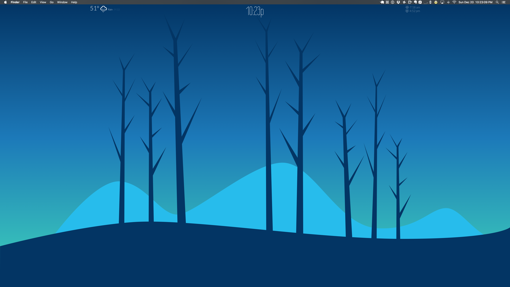

# wallpaper

An animated SVG background image with clock.

## Install

* Install [qdesktop](https://github.com/qvacua/qdesktop)
* Preferences | Set URL to http://wyne.github.io/wallpaper/

## Customize

Clone this repo locally and point qdesktop to a `file://` url.

# Credits

Inspired by bcezrstl on reddit:
https://www.reddit.com/r/unixporn/comments/3x9pir/mate_time_of_day_changing_wallpaper_light_and_flat/

Forked from [Julia Lim](http://codepen.io/juliamlim/)'s Pen [Time Changing Landscape](http://codepen.io/juliamlim/pen/zrYyVy/).
